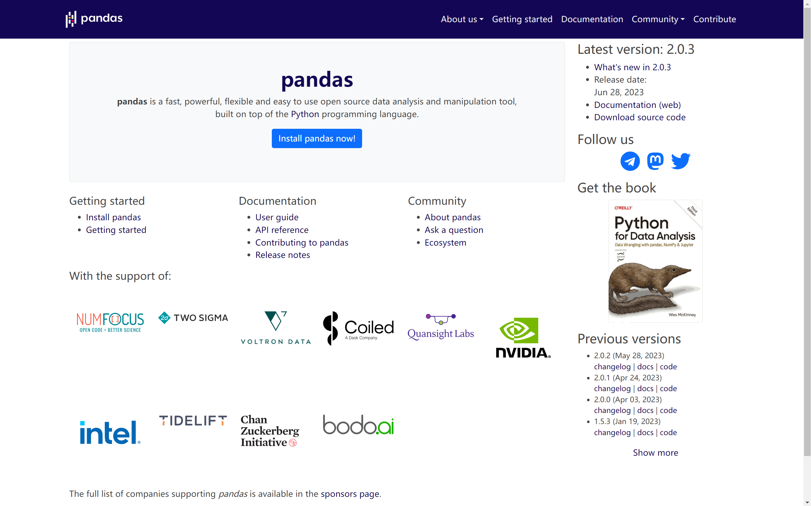

# 问题一：什么是Pandas？

* Pandas 提供了丰富的功能，使得数据处理和分析更加便捷。一些常用的功能包括：

  - 数据选择和过滤：通过行标签、列标签、位置等方式选择数据。
  - 数据清洗：处理缺失值和重复值，转换数据类型等。
  - 数据聚合：对数据进行分组并应用聚合函数。
  - 数据合并和连接：合并多个 DataFrame。
  - 时间序列处理：处理时间和日期相关的数据。

  Pandas 是数据科学家和分析师在 Python 生态系统中的重要工具，让数据分析变得高效且简便。它还与其他 Python 库（例如 NumPy、Matplotlib 和 Scikit-learn）紧密集成，形成了一个强大的数据处理和分析平台。

* 金融、统计、社会科学、工程、化工、生物、物理、天文等领域里的大多数案例。

* pip install pandas -i https://pypi.tuna.tsinghua.edu.cn/simple