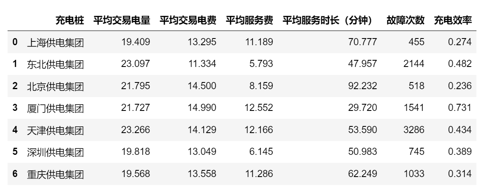

<p style="font-size: 90px;font-weight: bold;text-align: center;color: red;">带着问题学Pandas</p>
# <font color='red'>问题一百：不同城市充电桩充电效能分析？（项目实战）</font>

统计不同城市充电桩平均每次：

* 交易电量
* 交易电费
* 服务费
* 充电时长（分）（结束时间-开始时间）  
* 充电效率（平均每次的交易电量/平均每次的交易时长）
* 故障次数



### 时间序列、agg分组聚合、自定义函数

```Python
import numpy as np
import pandas as pd
data=pd.read_csv('./充电桩数据分析.csv')
data['充电结束时间'] = pd.to_datetime(data['充电结束时间'])
data['充电开始时间']=pd.to_datetime(data['充电开始时间'])
data['充电时长']=data.apply(lambda x:(x['充电结束时间']-x['充电开始时间']).seconds,axis=1)
data['充电时长']=data['充电时长']/60
```

异常值处理

```Python
res = data['充电结束时间'] - data['充电开始时间']

# 充电开始结束时间颠倒数据处理
cond = res.dt.days == -1
data.loc[cond,'充电开始时间'],data.loc[cond,'充电结束时间'] = data.loc[cond,'充电结束时间'],data.loc[cond,'充电开始时间']
data[cond]

# 充电时间异常
cond2 = res.dt.days > 1
display(res[cond2])
display(data[cond2])
data = data[~cond2]
data
```


```Python
3def count(item):
    return (item == '故障').sum()

result=data.groupby(['城市']).agg({"充电量（度）":"mean",
                               "费用":"mean",
                               "服务费":"mean",
                               "充电时长":"mean",
                               "故障情况":count}).reset_index()
result['充电效率']=result['充电量（度）'] / result['充电时长']
result = result.round(3)
result.columns=['充电桩','平均交易电量','平均交易电费','平均服务费','平均充电时长（分钟）',
                '故障次数','充电效率']
result.to_csv('./充电桩充电效能分析.csv',index=False)
result
```
