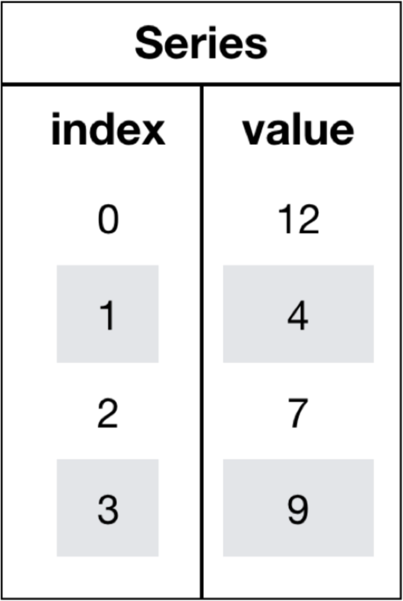

<p style="font-size: 90px;font-weight: bold;text-align: center;color: red;">带着问题学Pandas</p>


# <font color='red'>问题三：Series如何索引？</font>



在 Pandas 中，可以使用不同类型的索引来访问和操作 Series 中的数据。以下是 Series 的主要索引方法： 

### 1、位置索引

*  位置索引： 使用整数位置索引，类似于 Python 中的列表索引。

* 位置索引从 0 开始，可以使用方括号 `[整数]` 或者`iloc[整数]`来访问单个元素。 

  ```Python
  import pandas as pd
  data = [10, 20, 30, 40, 50]
  index = ['A', 'B', 'C', 'D', 'E']
  series = pd.Series(data, index=index)
  # 访问单个元素
  print(series[0])  # 输出：10
  print(series.iloc[-1]) # 输出：50
  ```

### 2、标签索引

* 使用自定义的<font color='red'>索引标签</font>来访问和操作 Series 中的数据。
* 使用方括号 `[标签名]` 或者`loc[标签名]`来访问单个元素。 

```Python
import pandas as pd
data = [10, 20, 30, 40, 50]
index = ['A', 'B', 'C', 'D', 'E']
series = pd.Series(data, index=index)
# 访问单个元素
print(series['B'])  # 输出：20
print(series.loc['D']) # 输出：40
```

