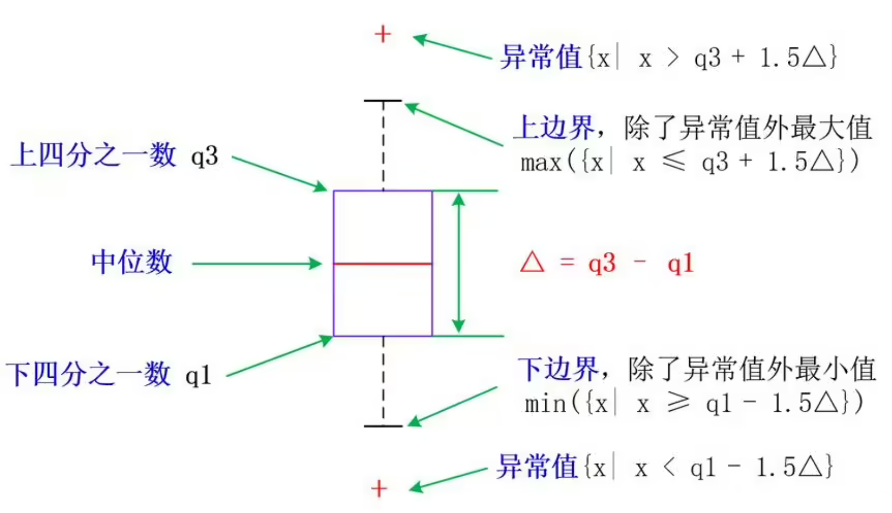

<p style="font-size: 90px;font-weight: bold;text-align: center;color: red;">带着问题学Pandas</p>
# <font color='red'>问题三十二：箱线图如何处理异常值？</font>

在 Pandas 中，您可以使用[箱线图](https://baike.baidu.com/item/%E7%AE%B1%E5%BD%A2%E5%9B%BE/10671164)来查看数据中的异常值，并可以根据箱线图的结果来处理这些异常值。Pandas 提供了 `boxplot()` 方法来绘制箱线图，它可以直观地显示数据的分布和异常值。



以下是使用箱线图处理异常值的步骤：

1. 绘制箱线图：使用 `boxplot()` 方法绘制数据的箱线图。
2. 确定异常值：观察箱线图，查找位于箱线之外的数据点，这些数据点被认为是异常值。
3. 处理异常值：根据实际情况，您可以选择删除异常值、替换为特定值或进行其他处理。

下面是一个示例代码，演示如何使用 Pandas 绘制箱线图并处理异常值：

```python
import pandas as pd
import matplotlib.pyplot as plt

# 示例数据，假设您有一个名为 "data" 的 DataFrame，包含一列数据 "values"。
data = pd.DataFrame({'values': [10, 12, 14, 16, 18, 20, 22, 24, 26, 60]})

# 绘制箱线图
data.boxplot(column='values')

# 显示箱线图
plt.show()

# 查找异常值
q1 = data['values'].quantile(0.25)
q3 = data['values'].quantile(0.75)
iqr = q3 - q1
lower_bound = q1 - 1.5 * iqr
upper_bound = q3 + 1.5 * iqr
cond = (data['values'] < lower_bound) | (data['values'] > upper_bound)

# 处理异常值，这里我们选择将异常值替换为中位数
data['values'][cond] = data['values'].median()

# 重新绘制箱线图，查看处理后的结果
data.boxplot(column='values')
plt.show()
```

在上述示例中，我们首先创建了一个包含异常值的示例数据 DataFrame `data`，然后使用 `boxplot()` 方法绘制了数据的箱线图。接下来，我们使用四分位数（Q1 和 Q3）和四分位距（IQR）来计算异常值的上下边界，并查找异常值。然后，我们根据需要选择了处理异常值的方法，这里我们选择将异常值替换为中位数。最后，我们再次绘制箱线图，查看处理后的结果。

请注意，处理异常值的方法取决于您的数据和分析目的。在实际应用中，您可能需要根据实际情况采取不同的处理方法，例如删除异常值、替换为特定值、进行插值或者进行其他的数据转换。