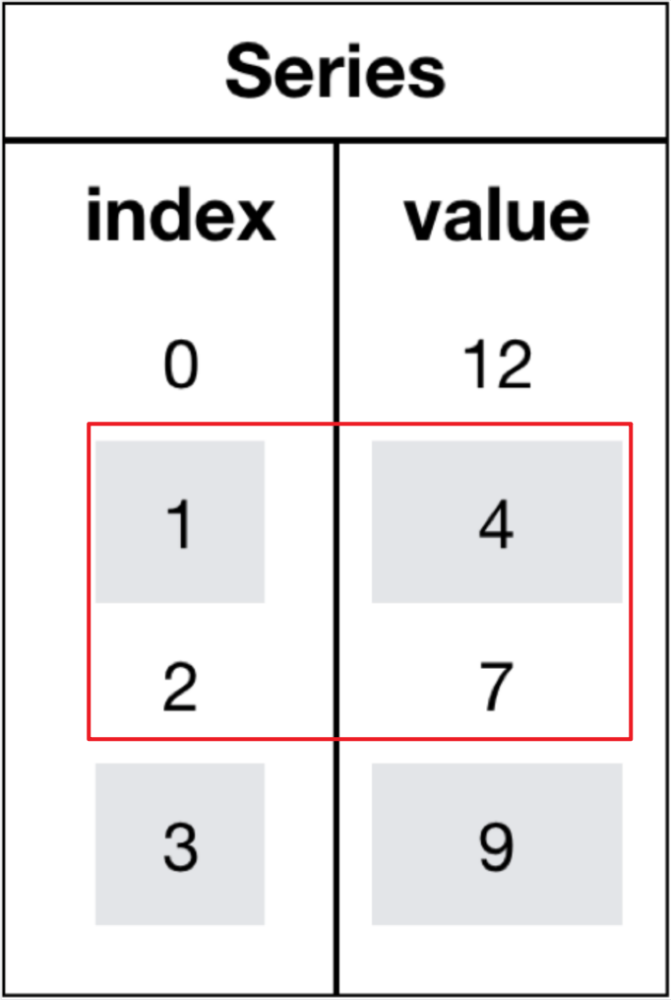

<p style="font-size: 90px;font-weight: bold;text-align: center;color: red;">带着问题学Pandas</p>


# <font color='red'>问题四：Series如何切片？</font>



在 Pandas 中，可以使用切片操作来从 Series 中提取<font color='red'>子集</font>数据。切片操作可以基于位置索引（整数位置）或标签索引（自定义索引标签）进行，具体取决于你使用的是 `iloc` 还是 `loc`。以下分别介绍这两种切片方式： 

### 1、位置索引

*   位置索引切片（使用 `iloc`）： 使用整数位置来进行切片操作。

* 切片的范围是<font color = 'red'>左闭右开</font>的，即包含起始位置的元素，但不包含结束位置的元素。  

  ```Python
  import pandas as pd
  data = [10, 20, 30, 40, 50]
  index = ['A', 'B', 'C', 'D', 'E']
  series = pd.Series(data, index=index)
  # 使用 iloc 切片数据
  s = series.iloc[1:4]
  display(s)
  ```

### 2、标签索引

*  标签索引切片（使用 `loc`）： 使用自定义索引标签来进行切片操作。

* 切片的范围是包含起始标签和结束标签的元素。 

  ```Python
  import pandas as pd
  data = [10, 20, 30, 40, 50]
  index = ['A', 'B', 'C', 'D', 'E']
  series = pd.Series(data, index=index)
  # 使用 loc 切片数据
  s = series.loc[1:4]
  display(s)
  ```

  

