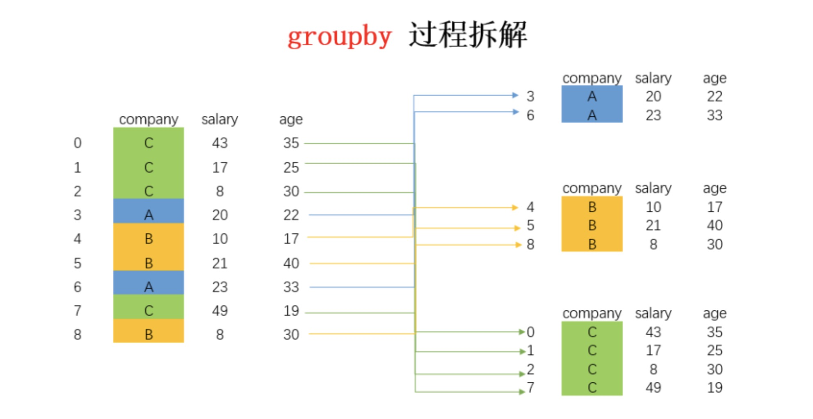

<p style="font-size: 90px;font-weight: bold;text-align: center;color: red;">带着问题学Pandas</p>
# <font color='red'>问题四十四：什么是分组操作？</font>

在 Pandas 中，分组（Grouping）是一种对数据进行分割、应用函数以及合并结果的操作。分组操作通常用于数据聚合、汇总和分析，它使得你可以根据某些特征将数据分成不同的组，并在每个组上应用相应的计算或操作。 



1. 以下是代码示例：

```python
import numpy as np
import pandas as pd
# 准备数据
df = pd.DataFrame(data = {'sex':np.random.randint(0,2,size = 300), # 0男，1女
                          'class':np.random.randint(1,9,size = 300),#1~8八个班
                          'Python':np.random.randint(0,151,size = 300),#Python成绩
                          'Keras':np.random.randint(0,151,size =300),#Keras成绩
                          'Tensorflow':np.random.randint(0,151,size=300),
                          'Java':np.random.randint(0,151,size = 300),
                          'C++':np.random.randint(0,151,size = 300)})
df['sex'] = df['sex'].map({0:'男',1:'女'}) # 将0，1映射成男女
# 1、分组->可迭代对象
# 1.1 先分组再获取数据
g = df.groupby(by = 'sex')[['Python','Java']] # 单分组
for name,data in g:
    print('组名：',name)
    print('数据：',data)
df.groupby(by = ['class','sex'])[['Python']] # 多分组
# 1.2 对一列值进行分组
df['Python'].groupby(df['class']) # 单分组
df['Keras'].groupby([df['class'],df['sex']]) # 多分组
```
