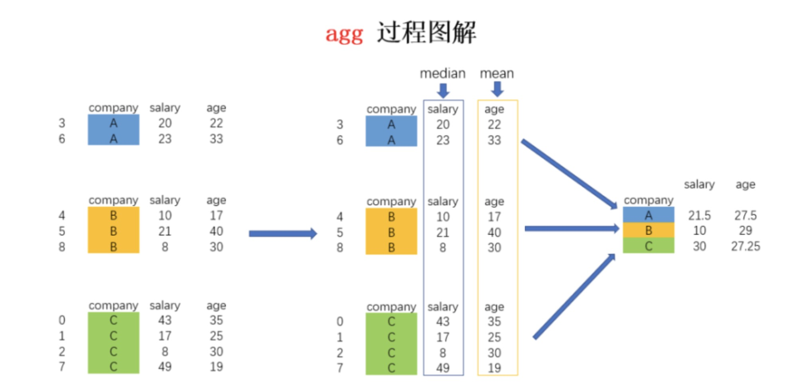
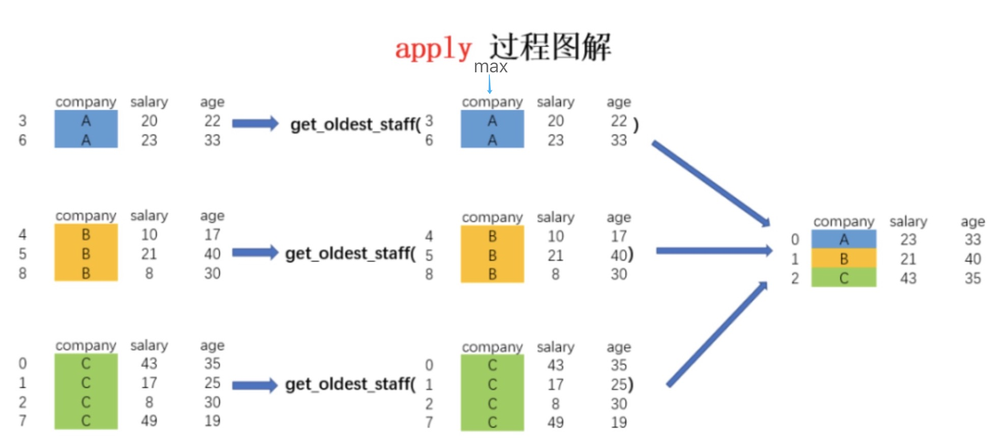
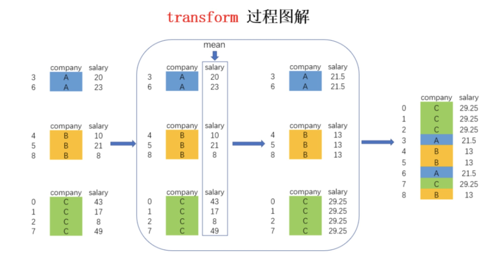

<p style="font-size: 90px;font-weight: bold;text-align: center;color: red;">带着问题学Pandas</p>
# <font color='red'>问题四十九：不同分组聚合函数有什么区别？</font>

在 Pandas 中，分组聚合是处理数据的常见操作，可以将数据按照某些标准分组，然后对每个组内的数据进行聚合计算。在这个过程中，`agg`、`apply` 和 `transform` 是三个常用的方法，它们在功能上有一些区别。

1. **agg (aggregate)**:
   `agg` 方法用于对分组后的数据执行聚合操作。你可以使用预定义的聚合函数（如 `sum`、`mean`、`max` 等），也可以使用自定义的聚合函数。`agg` 会将每个分组内的数据作为一个整体进行计算，然后将计算结果合并成一个数据框。

   ```python
   grouped = df.groupby('company')
   result_agg = grouped.agg({'salary': 'median', 'age': 'mean'})
   ```

   
   
2. **apply**:
   `apply` 方法用于将自定义函数应用于每个分组内的数据。这个函数可以执行更为复杂的操作，包括多个列之间的计算、过滤等。`apply` 返回的是一个包含每个分组应用函数后的结果的数据结构（例如数据框或序列）。

   ```python
   def custom_function(group):
       # custom calculations
       return result

   grouped = df.groupby('company')
   result_apply = grouped.apply(custom_function)
   ```

   
   
3. **transform**:
   `transform` 方法用于对每个分组内的数据应用函数，并将函数的结果与原始数据的结构保持一致。通常，`transform` 被用于生成一个与原始数据尺寸相同的数据结构，其中包含了每个分组应用函数后的结果。

   ```python
   def custom_function(group):
       # custom calculations
       return modified_group

   grouped = df.groupby('company')
   result_transform = grouped['salary'].transform(custom_function)
   ```
   
   

选择使用哪个方法取决于你的需求。如果你想对分组后的数据执行多种汇总操作，可以使用 `agg`。如果需要在每个分组内进行更复杂的操作，可以使用 `apply`。而如果你希望生成一个与原始数据尺寸相同的数据结构，其中包含每个分组应用函数后的结果，那么 `transform` 是更合适的选择。