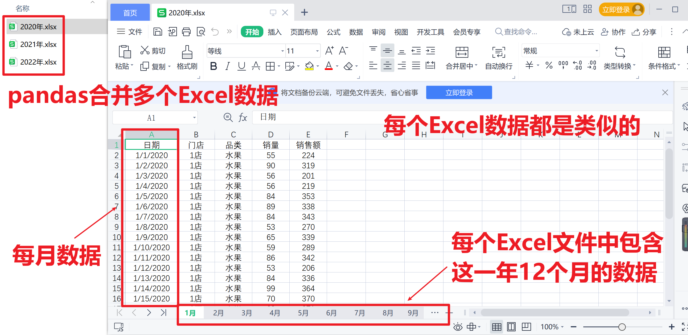

<p style="font-size: 90px;font-weight: bold;text-align: center;color: red;">带着问题学Pandas</p>
# <font color='red'>问题六十九：多Excel文件数据合并？</font>



```python
import pandas as pd
import os
dirs = os.listdir('./')
dirs = [file for file in dirs if file.endswith('.xlsx')]
print('目录下的Excel文件：',dirs)

data = pd.DataFrame()
for file in dirs:
    for sheet in range(12):
        df = pd.read_excel(file,index_col=0,sheet_name = sheet)
        print(f'{file}中的第{sheet}个表单保存完成！')
        data = pd.concat([data,df])
data.shape
```

`os.listdir(path)` 是 Python 中 `os` 模块中的一个函数，用于列出指定目录 `path` 中的所有文件和子目录的名称，并将它们以列表的形式返回。

以下是关于 `os.listdir` 函数的一些重要信息：

1. **参数 `path`**：这是一个字符串参数，表示要列出内容的目录路径。可以是相对路径或绝对路径。通常，你可以使用 `'./'` 来表示当前工作目录，或者提供一个指定的目录路径。
2. **返回值**：`os.listdir` 返回一个包含目录中所有文件和子目录名称的列表。列表中的每个元素都是字符串，代表一个文件或目录的名称。