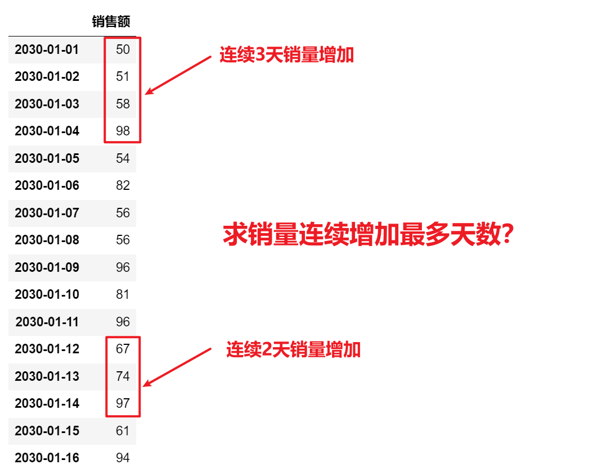

<p style="font-size: 90px;font-weight: bold;text-align: center;color: red;">带着问题学Pandas</p>
# <font color='red'>问题七十：连续增加指标如何统计计数？（难度10）</font>



数据模拟

```Python
import numpy as np
import pandas as pd
sail =pd.DataFrame(np.random.randint(50,150,size = 1000),
                   index= pd.date_range('2030-01-01',periods=1000),columns=['销售额'])
sail
```

数据处理

```Python
# 数据转变，True表示销售增加，False表示销售减少或者不变
res = sail.diff().dropna()['销售额'].map(lambda x : True if x > 0 else False).to_frame(name = '销售递增')
res
```

数据合并

```Python
df2 = pd.concat([sail,res],axis = 1)
df2
```

空数据删除

```Python
df2.dropna(inplace=True)
df2
```

数据错位

```Python
# shift默认向下移动一位，实现错位
# 比较错位前和错位后数据
df2['错位'] = df2['销售递增'].shift()
df2
```

错位比较

```Python
# True表示1，False表示0
df2['错位比较'] = df2['销售递增'].ne(df2['错位'])
df2
```

错位累加

```Python
# 如果是相同的数字，表示没有变换
# 数字变化了，表示销售递增状态发生了改变
df2['错位累加'] = df2['错位比较'].cumsum()
df2
```

连续状态计数

```Python
# 根据错位累加情况，进行分组统计数，如果错位累加情况是同一数字
# 表示销售额，是相同的递增或者递减情况
df2['连续状态计数'] = df2.groupby(by = '错位累加')['销售递增'].transform('size')
df2
```

增减区分

```Python
# 根据销售递增情况判断，递增区分
# 如果是递增，那么就是给与正值；如果是递减，那么就给与负值
df2['增减区分'] = df2['连续状态计数'] * np.where(df2['销售递增'],1,-1)
df2
```

最大递增区间获取

```Python
index = df2['增减区分'].argmax()
m = df2['增减区分'].max()
df2.iloc[index : index + m]
```

```Python
idx = df2['增减区分'].idxmax()
print(idx)
m = df2['增减区分'].max()
# 按照索引进行切片时，左闭右闭，所以，要减一
df2.loc[idx : idx + pd.DateOffset(days = int(m - 1))]
```

