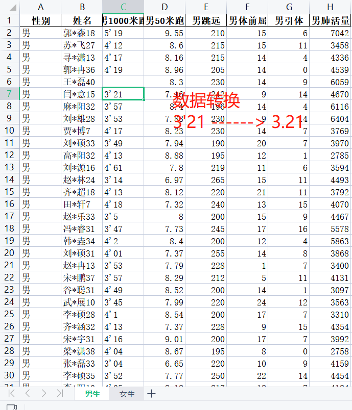

<p style="font-size: 90px;font-weight: bold;text-align: center;color: red;">带着问题学Pandas</p>
# <font color='red'>问题七十一：高中体测字符串类型数据如何转换？（项目实战）</font>



pandas字符串处理知识点`replace`

```Python
s1 = '我大学体能极限是1000米3分34秒！'
# 将我字替换为："派"。
# replace()函数中第一个是替换前的，第二个替换后的
s1 = s1.replace('我', 'MathDance')
print(s1)

# 将成绩转化为纯数字
s2 = "4'04" # 字符串
s2 = s2.replace('\'', '.')
s2 = float(s2) # 数据类型转换
print(s2)
```

替换常见错误，演示

```Python
score = ["4'03", "4'34", "4'29", "3'48", "3'58",4]
# for循环批量替换
for s in score:
    s = s.replace('\'', '.')
    print(s)
```

报错debug

```Python
score = ["4'03", "4'34", "4'29", "3'48", "3'58",4]
# for循环批量替换
for s in score:
    if isinstance(s,str):
        s = s.replace('\'', '.')
    print(s)
```

男生1000米跑成绩数据转换

```Python
import pandas as pd
# 加载男生的体测成绩
df_boy = pd.read_excel('./项目实战一（体测数据处理）/体测成绩.xlsx',sheet_name = '男生')
# 空数据处理：没有参加体能测试，成绩为0
df_boy = df_boy.fillna(0)
def convert(s):
    if isinstance(s, str):
        s = float(s.replace('\'', '.'))
    return s
df_boy['男1000米跑'].map(convert)
```

女生800米跑成绩数据转换

```Python
import pandas as pd
# 加载女生的体测成绩
df_girl = pd.read_excel('./项目实战一（体测数据处理）/体测成绩.xlsx',sheet_name = '女生')
# 空数据处理：没有参加体能测试，成绩为0
df_girl = df_girl.fillna(0)
def convert(s):
    if isinstance(s, str):
        s = float(s.replace('\'', '.'))
    return s
df_girl['女800米跑'].map(convert)
```

