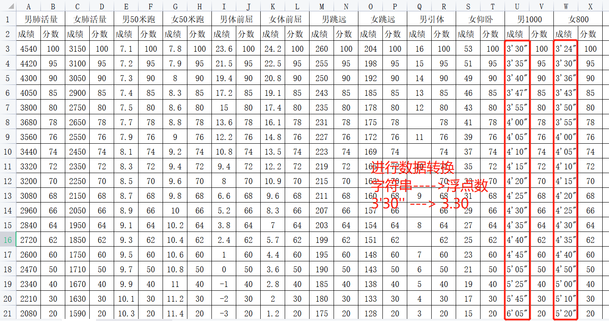

<p style="font-size: 90px;font-weight: bold;text-align: center;color: red;">带着问题学Pandas</p>
# <font color='red'>问题七十二：72-高中体测评分表数据转换？（项目实战）</font>



Series处理字符串方法`str.replace()`函数介绍

```Python
import pandas as pd
# 加载男生的体测成绩
df_boy = pd.read_excel('./项目实战一（体测数据处理）/体测成绩.xlsx',sheet_name = 0)
# 空数据处理：没有参加体能测试，成绩为0
df_boy['男1000米跑'].str.replace('\'','.')
```

体测评分数据转换

```Python
import numpy as np
import pandas as pd
# 评分标准，多层索引
# header:告诉pandas 第一行和第二行作为列索引
score = pd.read_excel('./项目实战一（体测数据处理）/体侧成绩评分表.xls',header=[0,1])
# 男生考核标准转换
score.iloc[:,-4] = score.iloc[:,-4].str.replace('\'','.').str.strip('"')
# 女生考核标准准换
score.iloc[:,-2] = score.iloc[:,-2].str.replace('\'','.').str.strip('"')
display(score,score.dtypes)
# -------数据类型转换-------
score[('男1000米跑','成绩')] = score[('男1000米跑','成绩')].astype(np.float64)
score[('女800米跑','成绩')] = score[('女800米跑','成绩')].astype(np.float64)
display(score,score.dtypes)
# -------数据持久化保存-------
score.to_excel('./项目实战一（体测数据处理）/体侧成绩评分表_处理.xlsx',header=[0,1])
```

