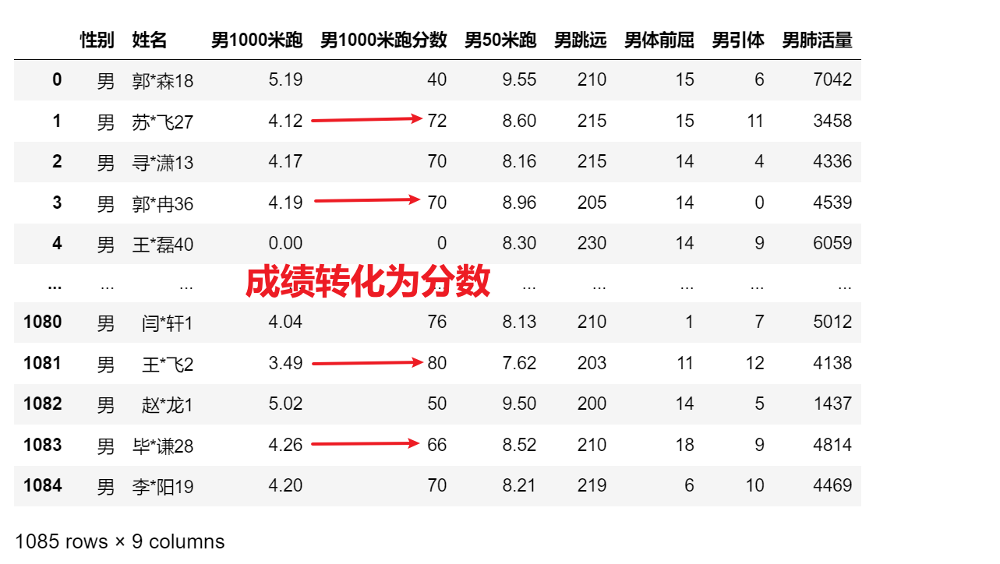

<p style="font-size: 90px;font-weight: bold;text-align: center;color: red;">带着问题学Pandas</p>
# <font color='red'>问题七十三：男1000米跑成绩分数转换？（项目实战）</font>



Series处理字符串方法`apply`函数处理转换

```Python
%%time
import pandas as pd
# 加载处理之后的男生体测成绩
df_boy = pd.read_excel('./项目实战一（体测数据处理）/体测成绩_男.xlsx')
# 加载成绩评分表
score = pd.read_excel('./项目实战一（体测数据处理）/体侧成绩评分表_处理.xlsx', header = [0,1],index_col=0)
# 定义转换方法
def convert(x):
    if x == 0: # 说明没有参加体能测试，分数为0分
        return 0
    for i in range(20): # 成绩划分20等级
        if x <= score['男1000米跑']['成绩'][i]:
            return score['男1000米跑']['分数'][i]
    return 0 # 说明跑的太慢了，分数为0分
result = df_boy['男1000米跑'].apply(convert)
df_boy.insert(3,column='男1000米跑分数',value= result)
df_boy
```
