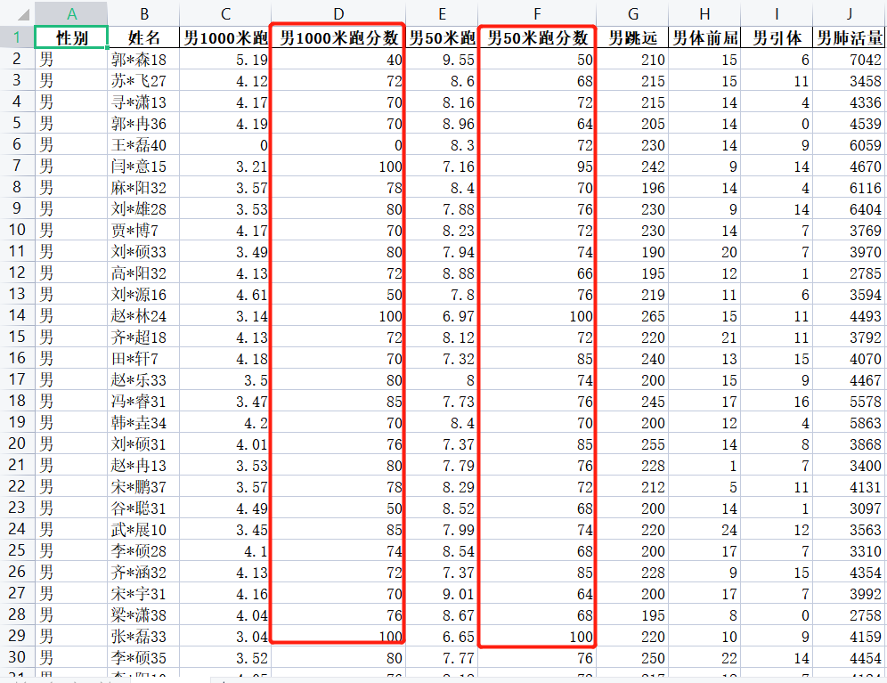

<p style="font-size: 90px;font-weight: bold;text-align: center;color: red;">带着问题学Pandas</p>
# <font color='red'>问题七十四：速度型成绩分数批量转换？（项目实战）</font>



`apply`函数传递参数方法使用

```Python
%%time
import numpy as np
import pandas as pd
df_boy = pd.read_excel('./项目实战一（体测数据处理）/体测成绩_男.xlsx')
score = pd.read_excel('./项目实战一（体测数据处理）/体侧成绩评分表_处理.xlsx', header = [0,1],index_col=0)
cols = ['男1000米跑', '男50米跑']
def convert(x, col):
    if x == 0: # 说明没有参加体能测试，分数为0分
        return 0
    for i in range(20): # 成绩划分20等级
        if x <= score[col]['成绩'][i]:
            return score[col]['分数'][i]
    return 0 # 说明跑的太慢了，分数为0分
for col in cols:
    # args 传入的参数 (col,)
    s = df_boy[col].apply(convert, args = (col,))
    columns = df_boy.columns.to_list()
    index = columns.index(col) + 1 # 这一列后面
    # 向这一列后面添加一列：分数
    df_boy.insert(loc = index, column = col + '分数', value = s)
df_boy.head(20)
```
