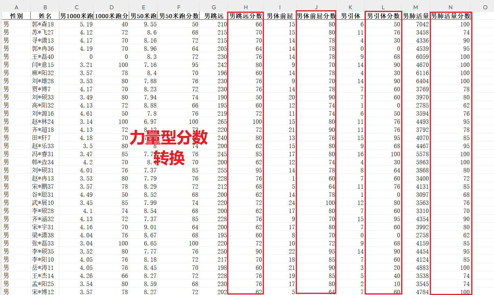

<p style="font-size: 90px;font-weight: bold;text-align: center;color: red;">带着问题学Pandas</p>
# <font color='red'>问题七十五：力量型成绩分数批量转换？（项目实战）</font>



`apply`函数传递参数方法使用

```Python
%%time
# convert自定义，名字任意
def convert(x, col):
    for i in range(20): # 成绩划分20等级
        if x >= score[col]['成绩'][i]:
            return score[col]['分数'][i]
    return 0 # 说明跳远不达标，分数为0分
cols = ['男跳远', '男体前屈','男引体', '男肺活量']
for col in cols:
    # apply ,args = (col,)代表某一列，成绩分数转换
    s = df_boy[col].apply(convert, args = (col,))
    columns = df_boy.columns.to_list()
    # 后面插入一列
    index = columns.index(col) + 1
    df_boy.insert(loc = index, column = col + '分数', value = s)
df_boy.head()
```
