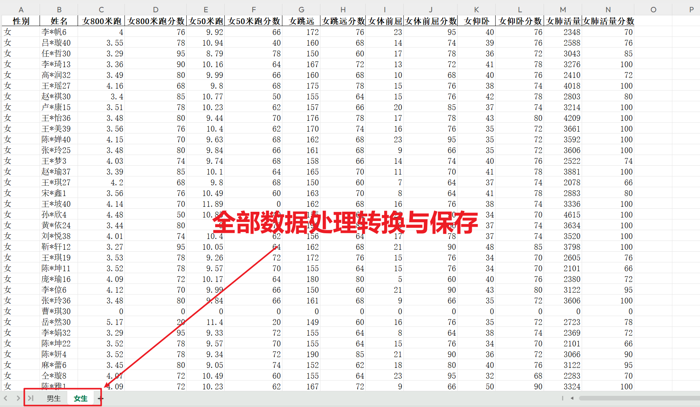

<p style="font-size: 90px;font-weight: bold;text-align: center;color: red;">带着问题学Pandas</p>
# <font color='red'>问题七十六：全部数据转换处理与保存？（项目实战）</font>



女生速度型数据批量处理

```Python
%%time
import numpy as np
import pandas as pd
df_girl = pd.read_excel('./项目实战一（体测数据处理）/体测成绩_女.xlsx')
score = pd.read_excel('./项目实战一（体测数据处理）/体侧成绩评分表_处理.xlsx', header = [0,1],index_col=0)
display(df_girl,score)
cols = ['女800米跑', '女50米跑']
def convert(x, col):
    if x == 0: # 说明没有参加体能测试，分数为0分
        return 0
    for i in range(20): # 成绩划分20等级
        if x <= score[col]['成绩'][i]:
            return score[col]['分数'][i]
    return 0 # 说明跑的太慢了，分数为0分
for col in cols:
    # args 传入的参数 (col,)
    s = df_girl[col].apply(convert, args = (col,))
    columns = df_girl.columns.to_list()
    index = columns.index(col) + 1 # 这一列后面
    # 向这一列后面添加一列：分数
    df_girl.insert(loc = index, column = col + '分数', value = s)
df_girl.head(20)
```

女生力量型批量处理

```Python
%%time
# convert自定义，名字任意
def convert(x, col):
    for i in range(20): # 成绩划分20等级
        if x >= score[col]['成绩'][i]:
            return score[col]['分数'][i]
    return 0 # 说明跳远不达标，分数为0分

cols = ['女跳远', '女体前屈','女仰卧', '女肺活量']
for col in cols:
    # apply ,args = (col,)代表某一列，成绩分数转换
    s = df_girl[col].apply(convert, args = (col,))
    columns = df_girl.columns.to_list()
    # 后面插入一列
    index = columns.index(col) + 1
    df_girl.insert(loc = index, column = col + '分数', value = s)
df_girl.head()
```

男女数据合并

```Python
with pd.ExcelWriter('./项目实战一（体测数据处理）/分数汇总.xlsx') as writer:
    df_boy.to_excel(writer, sheet_name = '男生', index = False)
    df_girl.to_excel(writer, sheet_name = '女生', index = False)
```