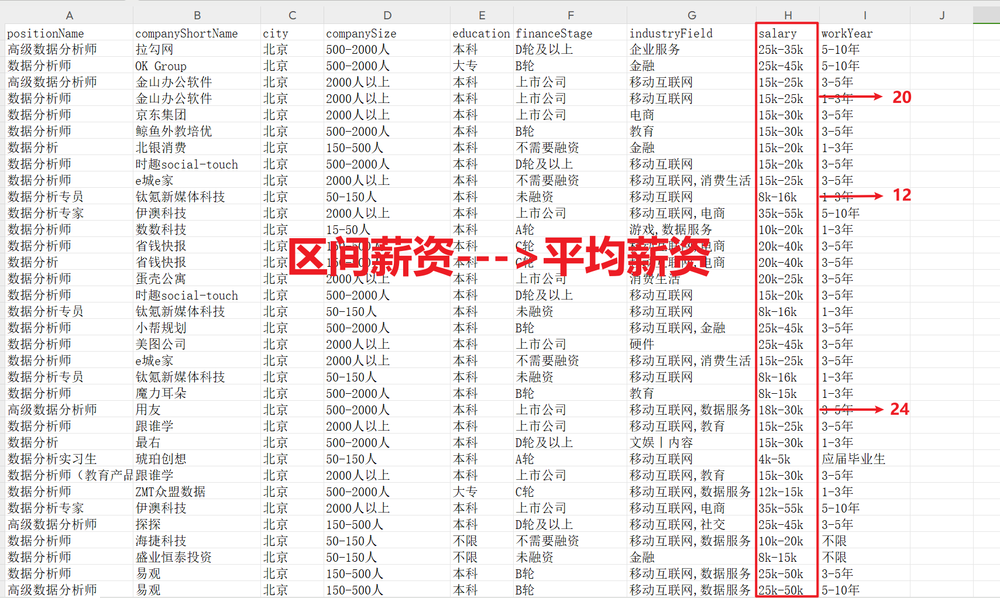

<p style="font-size: 90px;font-weight: bold;text-align: center;color: red;">带着问题学Pandas</p>
# <font color='red'>问题七十七：区间薪资转平均薪资？（招聘数据实战）</font>



根据岗位关键字`数据|分析`进行职位过滤

```Python
import pandas as pd
job = pd.read_csv('./项目实战二（招聘数据处理）/job.csv',encoding='gbk')
cond = job["positionName"].str.contains("数据|分析")
job[cond]
```

区间薪资转平均薪资


```Python
# 处理过程
# 1、将salary中的字符串均小写化（因为存在20K-40K，大写情况）
# 2、运用正则表达式提取出薪资区间
# 3、将提取出来的数字转化为int型
# 4、取区间的平均值
job["salary"] = job["salary"].str.lower()\
               .str.extract(r'(\d+)[k]-(\d+)k')\
               .applymap(lambda x:int(x))\
               .mean(axis=1)
```

