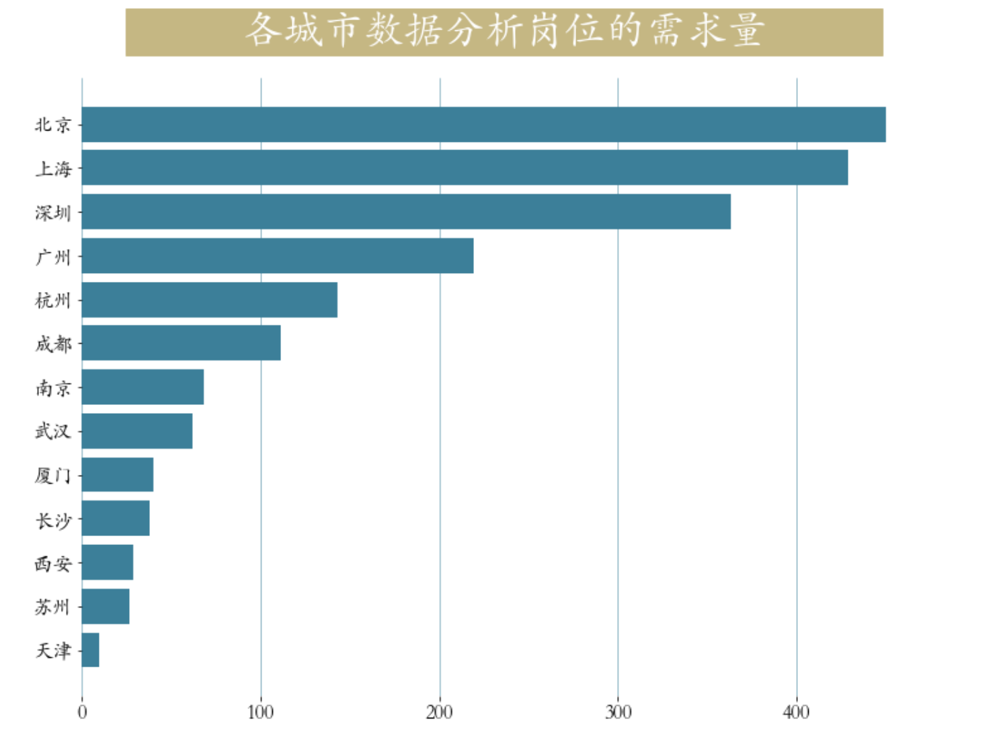

<p style="font-size: 90px;font-weight: bold;text-align: center;color: red;">带着问题学Pandas</p>
# <font color='red'>问题七十八：不同城市对数据分析的需求量？（招聘数据项目实战）</font>



根据城市关键字`value_counts`进行岗位数量统计并可视化

```Python
import matplotlib.pyplot as plt
plt.rcParams['font.family'] = 'STKaiti'
plt.figure(figsize=(12,9))
cities = job2['city'].value_counts() # 统计城市工作数量
plt.barh(y = cities.index[::-1],
        width = cities.values[::-1],
        color = '#3c7f99')
plt.box(False) # 不显示边框
plt.title(label='           各城市数据分析岗位的需求量           ', 
          fontsize=32, weight='bold', color='white', 
          backgroundcolor='#c5b783',pad = 30 )
plt.tick_params(labelsize = 16)
plt.grid(axis = 'x',linewidth = 0.5,color = '#3c7f99')
```

查询本机支持的中文字体

```Python
from matplotlib.font_manager import FontManager
fm = FontManager()
[font.name for font in fm.ttflist]
```

