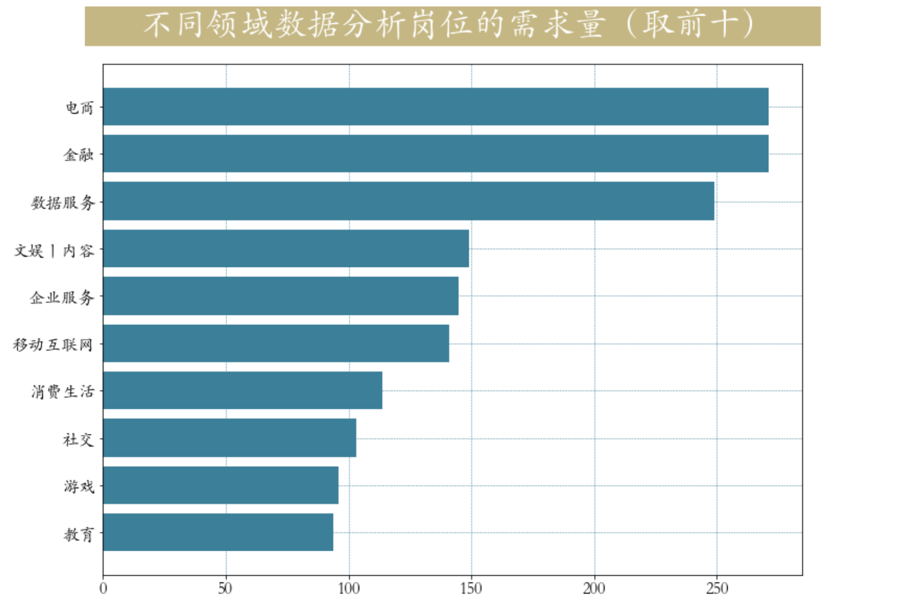

<p style="font-size: 90px;font-weight: bold;text-align: center;color: red;">带着问题学Pandas</p>
# <font color='red'>问题七十九：不同领域对数据分析的需求量？（招聘数据实战）</font>



根据`领域`字段进行精确提取

加载数据

```Python
import matplotlib.pyplot as plt
import pandas as pd
plt.rcParams['font.family'] = 'STKaiti'
job = pd.read_csv('./项目实战二（招聘数据处理）/数据分析岗位.csv')
job["industryField"].value_counts()[:30]
```

领域细分

```Python
def clean_industry(industry):
    industry = industry.split(",")
    if industry[0]=="移动互联网" and len(industry)>1:
        return industry[1]
    else:
        return industry[0]
job["industryField"] = job.industryField.map(clean_industry)
```

根据领域进行`value_counts`操作统计岗位数量并可视化

```Python
# 获取需求量前10多的领域
industry_index = job["industryField"].value_counts()[:10].index
industry =job.loc[job["industryField"].isin(industry_index),"industryField"]
plt.figure(figsize=(12,9))
plt.barh(y = industry_index[::-1],
         width=pd.Series.value_counts(industry.values).values[::-1],
         color = '#3c7f99')
plt.title(label='      不同领域数据分析岗位的需求量（取前十）     ', 
          fontsize=32, weight='bold', color='white', 
          backgroundcolor='#c5b783',ha = 'center',pad = 30)
plt.tick_params(labelsize=16)
plt.grid(lw = 0.5,color = '#3c7f99',ls = '--')
```

