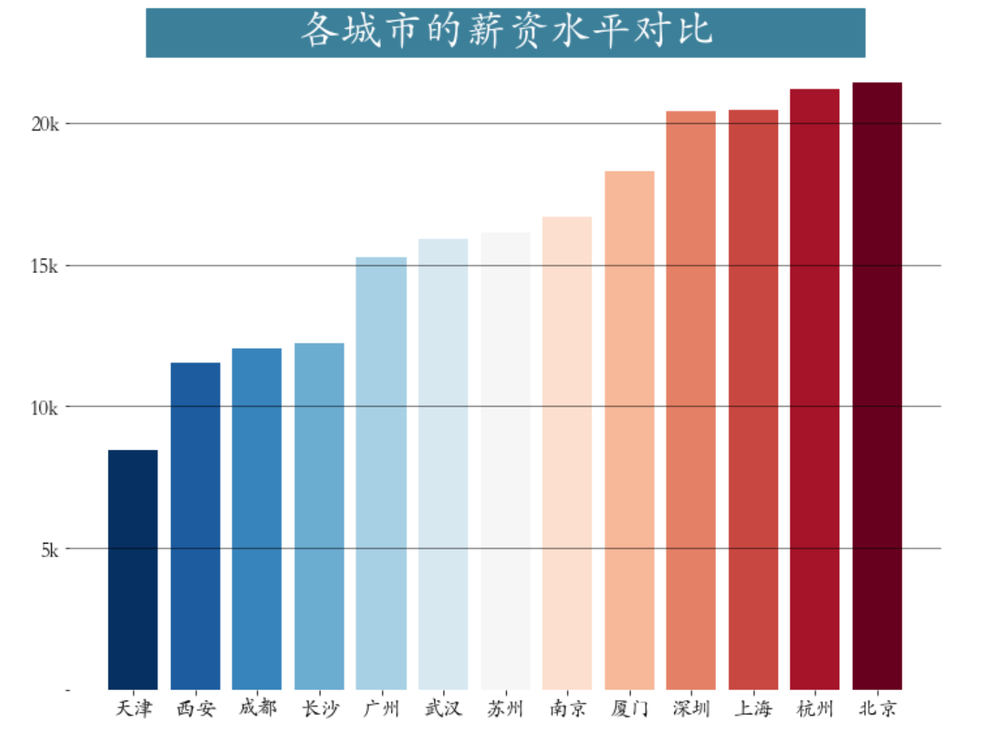

<p style="font-size: 90px;font-weight: bold;text-align: center;color: red;">带着问题学Pandas</p>
# <font color='red'>问题八十：不同城市数据分析薪资情况？（招聘数据实战）</font>




根据城市进行`groupby`分组计算薪资平均值并可视化

```Python
import matplotlib.pyplot as plt
import pandas as pd
import numpy as np
job = pd.read_csv('./项目实战二（招聘数据处理）/数据分析岗位.csv')

plt.figure(figsize=(12,9))
city_salary = job.groupby("city")["平均薪资"].mean().sort_values() # 分组聚合运算

plt.bar(x = city_salary.index,height = city_salary.values,
       color = plt.cm.RdBu_r(np.linspace(0,1,len(city_salary))))
plt.title(label='              各城市的薪资水平对比              ', 
         fontsize=32, weight='bold', color='white', backgroundcolor='#3c7f99')
plt.tick_params(labelsize=16)
plt.grid(axis = 'y',linewidth = 0.5,color = 'black')
plt.yticks(ticks = np.arange(0,25,step = 5,),labels = ['','5k','10k','15k','20k'])
plt.box(False) # 去掉边框
```

