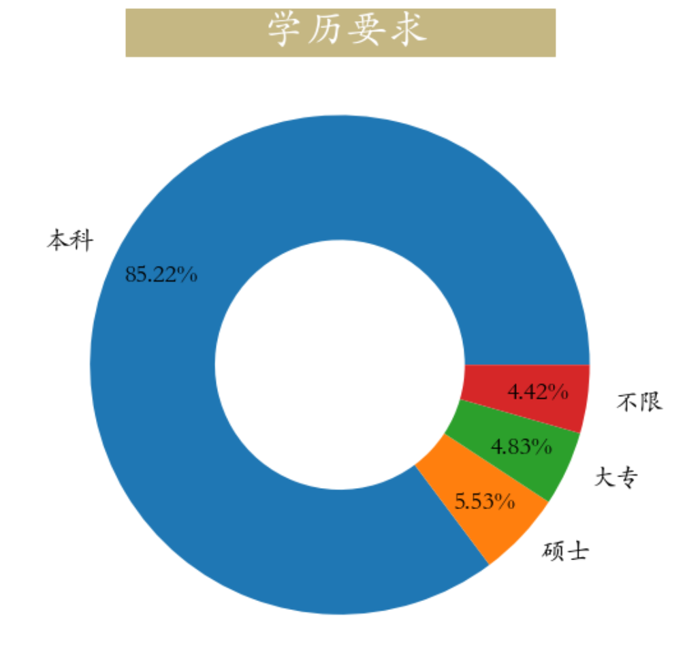

<p style="font-size: 90px;font-weight: bold;text-align: center;color: red;">带着问题学Pandas</p>
# <font color='red'>问题八十一：数据分析师对学历是什么要求？（招聘数据实战）</font>




根据`education`字段调用`value_counts(normalize = True)`计算学历百分比并可视化

```Python
import pandas as pd
import matplotlib.pyplot as plt
plt.rcParams['font.family'] = 'STKaiti'

job = pd.read_csv('./项目实战二（招聘数据处理）/数据分析岗位.csv')
education = job["education"].value_counts(normalize=True)
plt.figure(figsize=(9,9))
_ = plt.pie(education,labels=education.index,autopct='%0.2f%%',
            wedgeprops=dict(linewidth=3,width = 0.5),pctdistance=0.8,
            textprops = dict(fontsize = 20))
_ = plt.title(label='             学历要求            ', 
          fontsize=32, weight='bold', 
          color='white', backgroundcolor='#c5b783',pad = 10)
```

