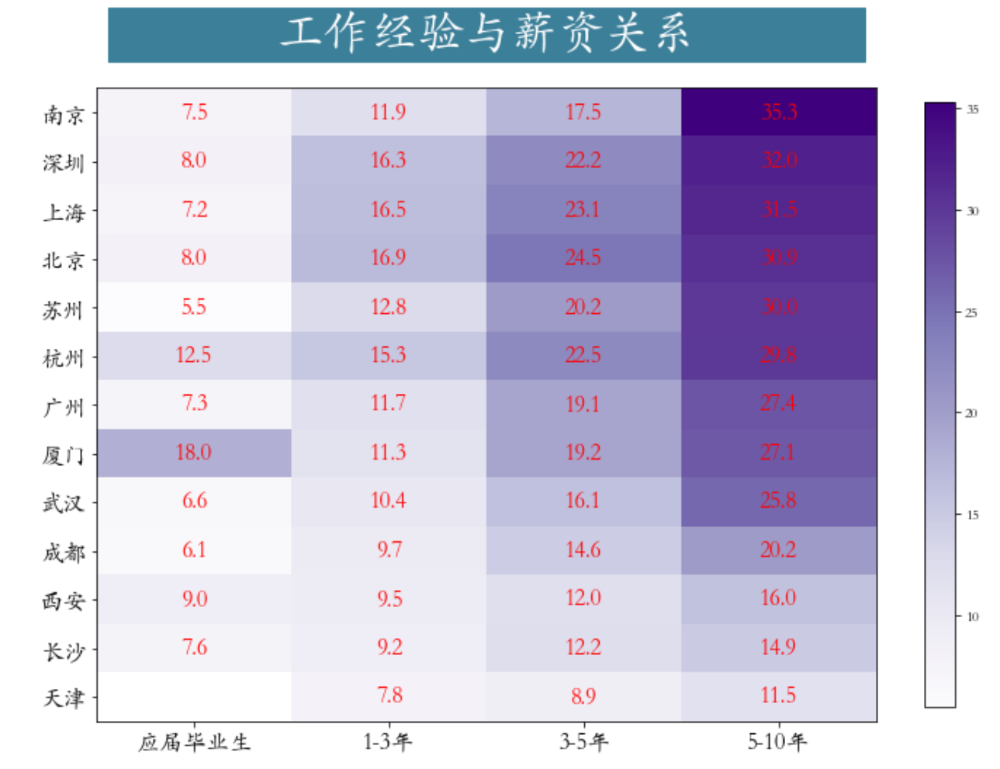

<p style="font-size: 90px;font-weight: bold;text-align: center;color: red;">带着问题学Pandas</p>
# <font color='red'>问题八十二：工作经验与薪水关系？（招聘数据实战）</font>




根据`workyear`与`平均薪资`字段调用`pivot_table`透视表分组计算不同年限薪资平均值情况并可视化

```Python
import numpy as np
import pandas as pd
import matplotlib.pyplot as plt
work_salary = job.pivot_table(index="city",columns="workYear",values="平均薪资") # 透视表
work_salary = work_salary[["应届毕业生","1-3年","3-5年","5-10年"]]\
              .sort_values(by = '5-10年',ascending = False) # 筛选一部分工作经验
data = work_salary.values
data = np.repeat(data,4,axis = 1) # 重复4次，目的画图，美观，图片宽度拉大
plt.figure(figsize=(12,9))
plt.imshow(data,cmap='Purples')

# 绘制文本
h,w = data.shape
for x in range(w):
    for y in range(h):
        if (x % 4 == 0) and (~np.isnan(data[y,x])):
            text = plt.text(x + 1.5, y, 
                            round(data[y,x],1),
                            ha="center", 
                            va="center", 
                            color='r',
                            fontsize = 16)
plt.xticks(np.array([1.5,5.5,9.5,13.5]),work_salary.columns)
plt.yticks(np.arange(13),work_salary.index)
plt.colorbar(shrink = 0.85)
plt.tick_params(labelsize = 16)
_ = plt.title(label='              工作经验与薪资关系              ', 
         fontsize=32, weight='bold', color='white', 
          backgroundcolor='#3c7f99',pad = 30)
```

