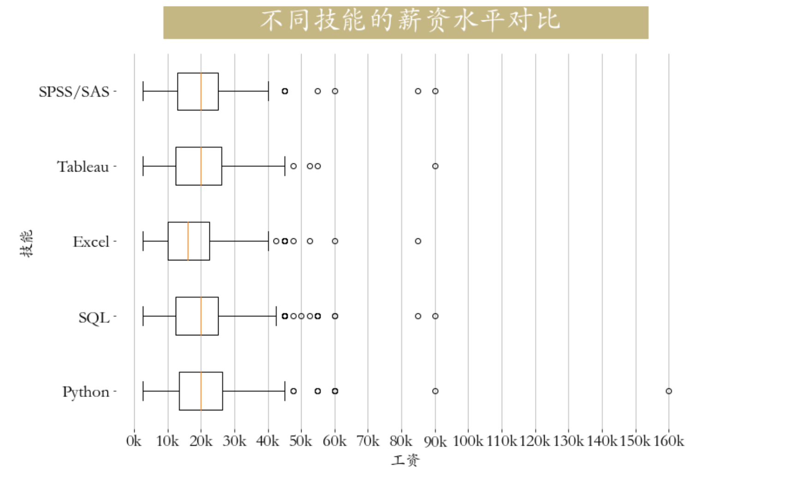

<p style="font-size: 90px;font-weight: bold;text-align: center;color: red;">带着问题学Pandas</p>
# <font color='red'>问题八十三：技能与薪资关系？（招聘数据实战）</font>




数据加载与处理

```Python
import pandas as pd
job = pd.read_csv('./项目实战二（招聘数据处理）/job.csv',encoding='gbk')
# 数据分析岗位筛选
cond = job["positionName"].str.contains("数据|分析|BI|bi")
job = job[cond].copy()
# 薪资转换，区间转平均薪资
job['salary'] = job["salary"].str.lower().str.extract(r'(\d+)k-(\d+)k').applymap(lambda x : int(x)).mean(axis = 1)
job
```

技能关键字提取

```Python
job["job_detail"] = job["job_detail"].str.lower()  #将字符串小写化，并将缺失值赋值为空字符串
job["Python"] = job["job_detail"].map(lambda x:1 if ('python' in x) else 0)
job["SQL"] = job["job_detail"].map(lambda x:1 if ('sql' in x) or ('hive' in x)  else 0)
job["Tableau"] = job["job_detail"].map(lambda x:1 if 'tableau' in x  else 0)
job["Excel"] = job["job_detail"].map(lambda x:1 if 'excel' in x  else 0)
job['SPSS/SAS'] = job['job_detail'].map(lambda x:1 if ('spss' in x) or ('sas' in x) else 0)
```

boxplot箱线图绘制

```Python
plt.figure(figsize=(12,8))
plt.boxplot([job.loc[job['Python'].astype('bool'),'salary'],
             job.loc[job['SQL'].astype('bool'),'salary'],
             job.loc[job['Excel'].astype('bool'),'salary'],
             job.loc[job['Tableau'].astype('bool'),'salary'],
             job.loc[job['SPSS/SAS'].astype('bool'),'salary'],],
            vert = False,labels=['Python','SQL','Excel','Tableau','SPSS/SAS'])

plt.title(label='             不同技能的薪资水平对比            ', 
          fontsize=32, weight='bold', color='white', 
          backgroundcolor='#c5b783',pad = 30)
plt.tick_params(axis="both",labelsize=20)
plt.grid(axis = 'x',linewidth = 0.75)
plt.xticks(np.arange(0,161,20), [str(i)+"k" for i in range(0,161,20)])
plt.box(False)
plt.xlabel('工资', fontsize=18)
_ = plt.ylabel('技能', fontsize=18)
```

