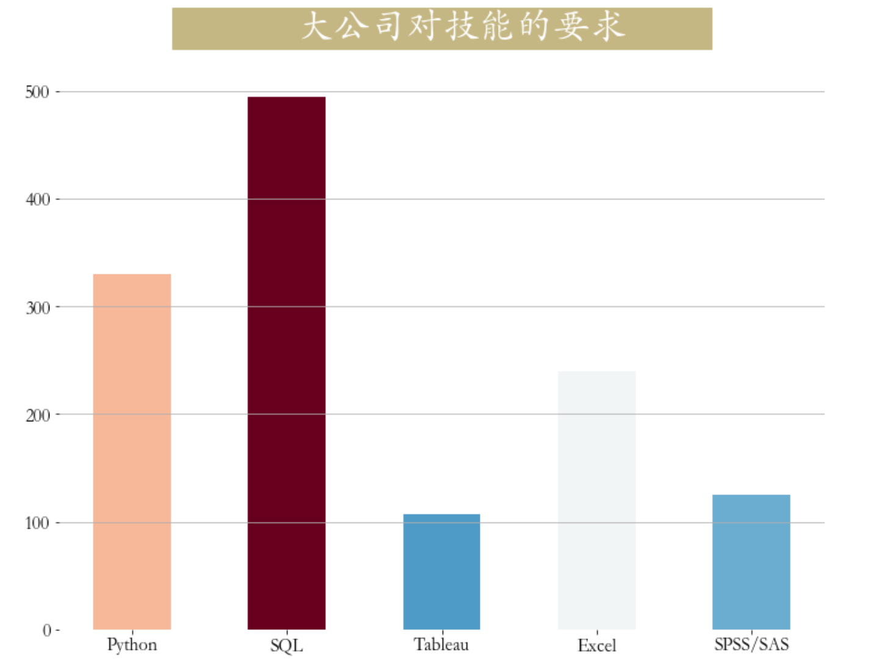

<p style="font-size: 90px;font-weight: bold;text-align: center;color: red;">带着问题学Pandas</p>
# <font color='red'>问题八十四：大公司侧重什么技术？（招聘数据实战）</font>




数据加载与处理

```Python
import pandas as pd
job = pd.read_csv('./项目实战二（招聘数据处理）/job.csv',encoding='gbk')
# 数据分析岗位筛选
cond = job["positionName"].str.contains("数据|分析|BI|bi")
job = job[cond].copy()
# 薪资转换，区间转平均薪资
job['salary'] = job["salary"].str.lower().str.extract(r'(\d+)k-(\d+)k').applymap(lambda x : int(x)).mean(axis = 1)
job["job_detail"] = job["job_detail"].str.lower()  #将字符串小写化，并将缺失值赋值为空字符串
job["Python"] = job["job_detail"].map(lambda x:1 if ('python' in x) else 0)
job["SQL"] = job["job_detail"].map(lambda x:1 if ('sql' in x) or ('hive' in x)  else 0)
job["Tableau"] = job["job_detail"].map(lambda x:1 if 'tableau' in x  else 0)
job["Excel"] = job["job_detail"].map(lambda x:1 if 'excel' in x  else 0)
job['SPSS/SAS'] = job['job_detail'].map(lambda x:1 if ('spss' in x) or ('sas' in x) else 0)
job
```

大公司技能侧重可视化

```Python
import matplotlib.pyplot as plt
skill_count = job[job['companySize'] == '2000人以上'][['Python','SQL','Tableau','Excel','SPSS/SAS']].sum()
plt.figure(figsize=(12,9))
plt.bar(np.arange(5),skill_count,
        tick_label = ['Python','SQL','Tableau','Excel','SPSS/SAS'],
        width = 0.5,
        color = plt.cm.RdBu_r(skill_count/skill_count.max()))
_ = plt.title(label='             大公司对技能的要求         ', 
          fontsize=32, weight='bold', color='white', 
          backgroundcolor='#c5b783',pad = 30)
plt.tick_params(labelsize=16,)
plt.grid(axis = 'y')
plt.box(False)
```

