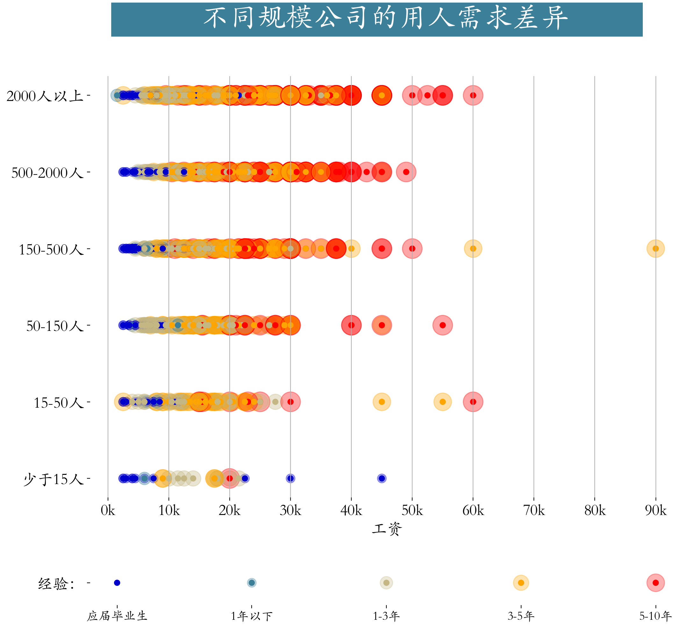

<p style="font-size: 90px;font-weight: bold;text-align: center;color: red;">带着问题学Pandas</p>
# <font color='red'>问题八十五：大中小公司招聘差异？（招聘数据实战）</font>




数据加载与处理

```Python
import pandas as pd
import numpy as np
import matplotlib.pyplot as plt
job = pd.read_csv('./项目实战二（招聘数据处理）/job.csv',encoding='gbk')
# 数据分析岗位筛选
cond = job["positionName"].str.contains("数据|分析|BI|bi")
job = job[cond].copy()
# 薪资转换，区间转平均薪资
job['salary'] = job["salary"].str.lower().str.extract(r'(\d+)k-(\d+)k').applymap(lambda x : int(x)).mean(axis = 1)
job
```

大中小公司招聘需求差异

```Python
cond = job['salary'] != 160
job = job[cond]
from matplotlib import gridspec
plt.rcParams['font.family'] = 'STKaiti'
workYear_map = {
    "5-10年": 5,
    "3-5年": 4,
    "1-3年": 3,
    "1年以下": 2,
    "应届毕业生": 1}
color_map = {
    5:"#ff0000",
    4:"#ffa500",
    3:"#c5b783",
    2:"#3c7f99",
    1:"#0000cd"}
cond = job.workYear.isin(workYear_map)
result = job[cond].copy()
result.loc[:,'workYear'] = job['workYear'].map(workYear_map)
# 根据companySize进行排序，人数从多到少
result['companySize'] = result['companySize'].astype('category')
list_custom = ['2000人以上', '500-2000人','150-500人','50-150人','15-50人','少于15人']
result['companySize'] = result['companySize'].cat.reorder_categories(list_custom)
result.sort_values(by = 'companySize',inplace = True,ascending = False)

plt.figure(figsize=(12,11))
gs = gridspec.GridSpec(10,1)
plt.subplot(gs[:8])
plt.suptitle(t='            不同规模公司的用人需求差异          ', 
         fontsize=32, 
         weight='bold', color='white', backgroundcolor='#3c7f99')
plt.scatter(result.salary,result.companySize,
            c = result.workYear.map(color_map),
            s = (result.workYear*100),alpha = 0.35)
plt.scatter(result.salary,result.companySize,
            c = result.workYear.map(color_map))
plt.grid(axis = 'x')
plt.xticks(np.arange(0,100,10), [str(i)+"k" for i in range(0,100,10)])
plt.xlabel('工资', fontsize=18)
plt.box(False)
plt.tick_params(labelsize = 18)

# 绘制底部标记
plt.subplot(gs[9:])
x = np.arange(5)[::-1]
y = np.zeros(len(x))
s = x*100
plt.scatter(x,y,s=s,c=color_map.values(),alpha=0.3)
plt.scatter(x,y,c=color_map.values())
plt.box(False)
plt.xticks(ticks=x,labels=list(workYear_map.keys()),fontsize=14)
plt.yticks(np.arange(1),labels=['  经验：'],fontsize=18)
plt.savefig('./85-大中小公司招聘差异？.png',bbox_inches = 'tight',dpi =200)
```

