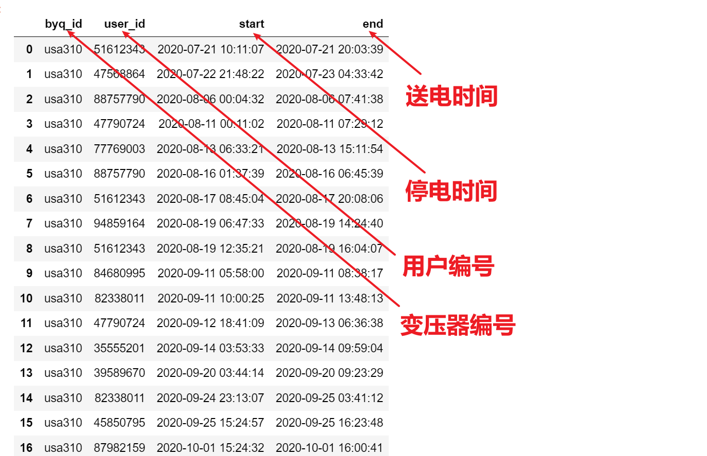
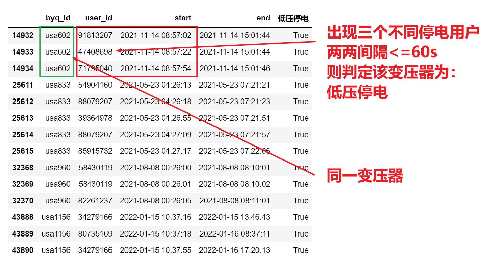

<p style="font-size: 90px;font-weight: bold;text-align: center;color: red;">带着问题学Pandas</p>
# <font color='red'>问题八十六：低压停电事故统计计数？（项目实战）</font>



统计所有疑似低压停电导致的停上电事件，该类事件满足如下条件:

------

在同变压器下，存在至少 3 个不同用户，且它们<font color='red'>**两两之间**</font>的停电时间相近 (小于等于60 秒)。

------

这类停电事件称为低压停电导致的停上电事件，筛选出所有该类事件输出为 incident.csv



数据加载与处理

```Python
import pandas as pd
data = pd.read_csv('./美电网数据/use1.csv')
display(data.head(10),data.shape)
print(data.duplicated().sum()) # 查看是否有重复数据
# 时间类型转换，便于计算
display(data.dtypes)
data['start'] = pd.to_datetime(data['start'])
data['end'] = pd.to_datetime(data['end'])
display(data.dtypes)
data.head(10)
```

相同变压器不同用户间<font color='red'>两两停电间隔计算</font>

```Python
def convert(x):
    x.sort_values(by = 'start').reset_index(drop = True,inplace = True)
    r1 = x['start'].diff(1).dt.total_seconds().fillna(method = 'bfill') <= 60
    r2 = x['start'].diff(-1).dt.total_seconds().fillna(method = 'bfill') >= -60
    return pd.DataFrame({'byq_id':x['byq_id'],
                         'user_id':x['user_id'],
                         'start':x['start'],
                         'end':x['end'],
                         '低压停电':r1 | r2})
result = data.groupby(by = 'byq_id').apply(convert)
result
```

筛选低压停电

```Python
cond = result['低压停电']
res1 = result[cond]
res1
```

筛选同变压器下至少 3 个不同用户

```Python
cond2 = res1.groupby(by = 'byq_id').size() >= 3
byq_ids = cond2[cond2].index
cond = res1['byq_id'].isin(byq_ids)
res2 = res1[cond]
display(res2)
res2.to_csv('./美电网数据/accident.csv',index=False)
```

