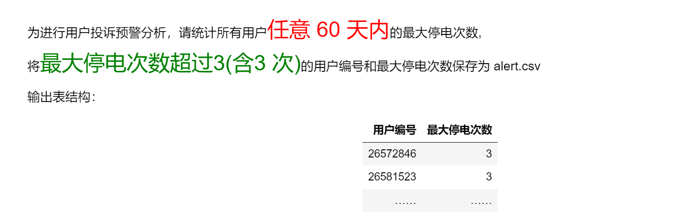

<p style="font-size: 90px;font-weight: bold;text-align: center;color: red;">带着问题学Pandas</p>
# <font color='red'>问题八十七：用户投诉预警分析？（项目实战）</font>




数据加载与处理

```Python
import pandas as pd
data = pd.read_csv('./美电网数据/use1.csv')
data['start'] = pd.to_datetime(data['start']).dt.date
data['start'] = pd.to_datetime(data['start'])
data.set_index('start',inplace=True)
display(data.head(10),data.dtypes)
```

任意60天内<font color='red'>最大停电次数</font>

```Python
%%time
def convert(df):
    df.sort_index(inplace = True) # 按照时间排序，从小到大
    m = 0
    for i in range(len(df)):
        res = df.iloc[i:].resample('60D').size()
        if m < res.max():
            m = res.max()
    return m
result = data.groupby(by = 'user_id').apply(convert).to_frame('任意60天内最大停电次数')
result
```

筛选投诉预警用户

```Python
cond = result['任意60天内最大停电次数'] >= 3
res = result[cond].reset_index()
res.columns = ['用户编号','最大停电次数']
display(res)
res.to_csv('./美电网数据/alert.csv',index=False)
```

数据验证

```Python
cond = data['user_id'] == 38474295    
df1 = data[cond].copy()
display(df1)
def convert(item):
    print('+++++++++++++++++++++++',item.size)
    display(item)
    return item.size 
m = 0
for i in range(len(df1)):
    res = df1.iloc[i:].resample('60D')['user_id'].apply(convert)
    print('--------------------------')
    if m < res.max():
        m = res.max()
    display(res)
print('*'*30,m,'*'*30)
```

