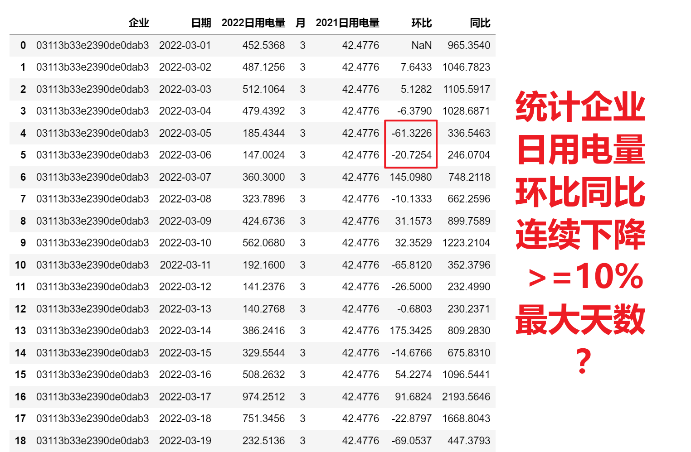

<p style="font-size: 90px;font-weight: bold;text-align: center;color: red;">带着问题学Pandas</p>
# <font color='red'>问题八十九：统计企业用电量同比和环比连续下降>=10%的最大天数？</font>



### 方式一

[问题70-连续增加指标如何统计计数？](https://www.bilibili.com/video/BV1v94y1Y7Nm?p=70)

```Python
import numpy as np
import pandas as pd
df = pd.read_csv('./2022企业日用电量环比同比.csv')
df['环比'] = df['环比'] <=  -10
df['同比'] = df['同比'] <=  -10
def cv(item):
    values = []
    for col in ['环比','同比']:
        g = item[col].ne(item[col].shift()).cumsum()
        ret = item.groupby(g)[col].transform('count') * np.where(item[col],1,-1)
        ret_max = ret.max() if ret.max() > 0 else 0
        values.append(ret_max)
    return pd.DataFrame({'同比下降最大天数':values[1],
                         '环比下降最大天数':values[0],
                         '企业':item['企业'].iloc[0]},
                        index = item.index[[0]])
sub = df.groupby('企业')[['企业','环比','同比']].apply(cv)
sub[['企业','同比下降最大天数','环比下降最大天数']].\
to_csv('./企业用电运营分析/企业用电量同比和环比连续下降大于等于10%的最大天数.csv',index = False)
result1 = pd.read_csv('./企业用电运营分析/企业用电量同比和环比连续下降大于等于10%的最大天数（方式一）.csv')
result1.head(20)
```

### 方式二

```Python
import numpy as np
import pandas as pd
df = pd.read_csv('./2022企业日用电量环比同比.csv')
df['环比'] = df['环比'] <=  -10
df['同比'] = df['同比'] <=  -10
def func(item):
    res1 = item['同比'].expanding().apply(lambda r:reduce(lambda x,y:x + 1 if y > 0 else 0, r))
    res2 = item['环比'].expanding().apply(lambda r:reduce(lambda x,y:x + 1 if y > 0 else 0, r))
    return [res1.max(),res2.max()]
result2 = df.groupby(by = df['企业']).apply(func)
# 转为DataFrame
result2 = result2.apply(pd.Series)
# 修改列名
result2.columns = ['同比下降最大天数','环比下降最大天数']
# 数据保存
result2.to_csv('./企业用电运营分析/企业用电量同比和环比连续下降大于等于10%的最大天数（方式二）.csv')
```

### 方式二（解读）

#### expanding函数

```Python
import pandas as pd
# 创建一个示例数据框
data = {'A': [1, 2, 3, 4, 5]}
data = pd.DataFrame(data)
# 使用expanding()计算累积和
expanding_sum = data['A'].expanding().sum()
data['滚动求和'] = expanding_sum
data
```

#### reduce函数

* reduce函数简单示例

```Python
from functools import reduce
# 创建一个包含数字的列表
numbers = [1, 2, 3, 4, 5]
# 使用reduce函数计算列表中所有元素的累积乘积
def func(x,y):
    print('-----------------',x,y)
    return x * y
result = reduce(lambda x, y: x * y, numbers)
# result = reduce(func, numbers)
print(result)
```

* 结合项目数据

```Python
from functools import reduce

cond = df['企业'] == '004b71f92cd6f18c8287'
data = df[cond].copy()
res = data['环比'].expanding().apply(lambda r:reduce(lambda x,y : x + 1 if y > 0 else 0,r))
data['环比下降'] = res
display(data.iloc[:20],res.max())
res.max()

# # 定义自定义函数convert
# def convert(x, y):
#     if y > 0: # 后一个大于0，表示为True，对应题目：连续下降
#         return x + 1
#     else:
#         return 0
# cond = df['企业'] == '004b71f92cd6f18c8287'
# data = df[cond].copy()
# res  = data['环比'].expanding().apply(lambda r: reduce(convert, r))
# data['环比下降'] = res
# display(data.iloc[:20],res.max())
```

