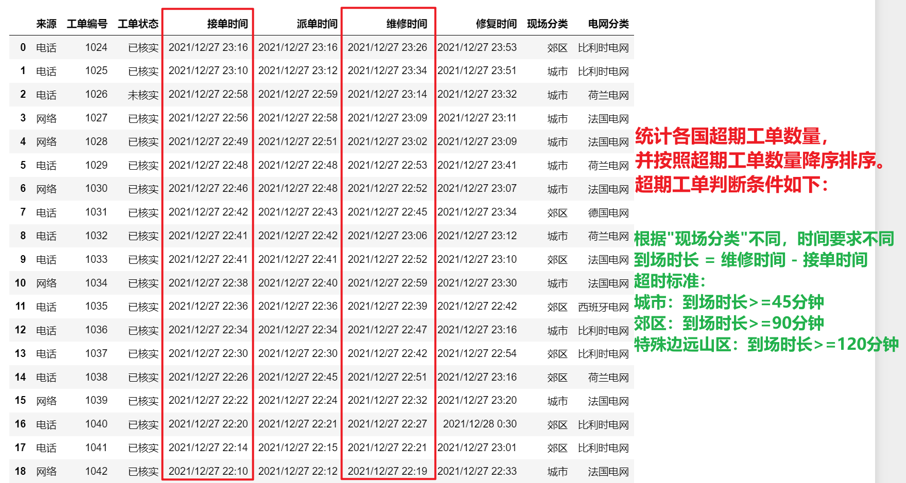

<p style="font-size: 90px;font-weight: bold;text-align: center;color: red;">带着问题学Pandas</p>
# <font color='red'>问题九十：超期工单预警分析（项目实战）？</font>



筛选数据来源为“电话”并且状态为“已核实”的抢修记录数据

对筛选后的数据，按照**各国家电网**分别统计<font color='red'>**超期工单**</font>数量，并按照超期工单数量降序排序，超期工单判断条件如下：

根据“现场分类”不同，时间要求不同（到场时长=维修时间-接单时间）：  
* 城市：到场时长>=45分钟即为超时；  
* 郊区：到场时长>=90分钟即为超时；  
* 特殊边远山区：到场时长>=120分钟即为超时。

筛选数据来源为“电话”并且状态为“已核实”的抢修记录数据

```Python
import pandas as pd
data = pd.read_csv('./欧洲电网故障抢修分析.csv')
c1 = data['来源'] == '电话'
c2 = data['工单状态'] == '已核实'
cond = c1 * c2
result = data[cond].copy()
result
```

超时工单处理

```Python
result['接单时间'] = pd.to_datetime(result['接单时间']) 
result['维修时间'] = pd.to_datetime(result['维修时间']) # 接单登记时间
result['到场时间'] = result['维修时间'] - result['接单时间']
idx = -1
def func(item):
    global idx
    idx += 1
    if (result['现场分类'].iloc[idx] == '城市') & (item >= pd.Timedelta(45,'m')):
        return '超时'
    elif (result['现场分类'].iloc[idx] == '郊区') & (item >= pd.Timedelta(90,'m')):
        return '超时'
    elif (result['现场分类'].iloc[idx] == '特殊边远山区') & (item >= pd.Timedelta(120,'m')):
        return '超时'
    else:
        return '正常'
result['超时'] = result['到场时间'].apply(func)
result
```

超期工单分组计数

```Python
cond = result['超时'] == '超时'
res = result[cond]
res = res.groupby('电网分类')['超时'].count().reset_index()
res.sort_values(by = '超时',ascending=False,inplace=True)
res.columns = ['电网分类','超期工单数量']
res
```

