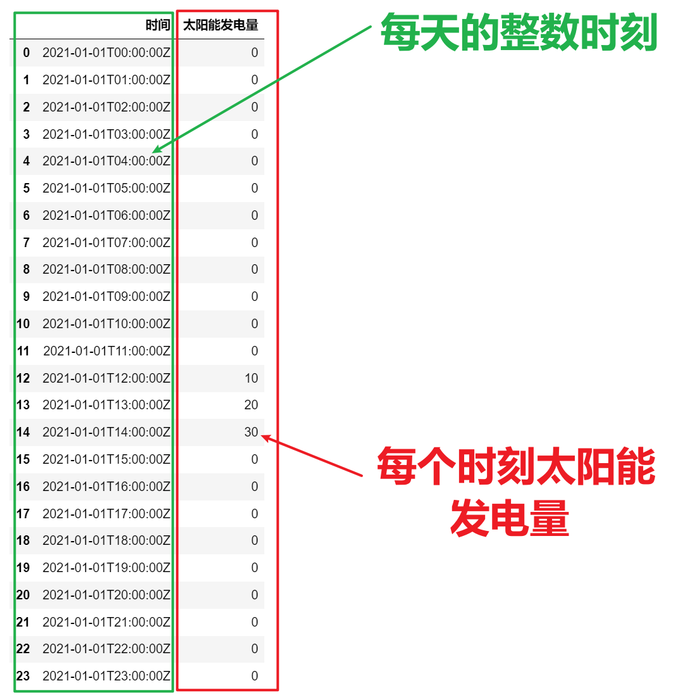

<p style="font-size: 90px;font-weight: bold;text-align: center;color: red;">带着问题学Pandas</p>
# <font color='red'>问题九十一：统计太阳能发电每天最大值和对应时刻？（项目实战）</font>



数据加载与时间处理

```Python
import pandas as pd
data = pd.read_csv('./太阳能发电/太阳能发电量分析.csv')
data['时间'] = pd.to_datetime(data['时间'])
data['日期'] = data['时间'].dt.date
data['时分秒'] = data['时间'].dt.time
data
```

在日期时间字符串 "2021-01-01T00:00:00Z" 中，T 和 Z 是 ISO 8601 标准格式中的两个重要元素，用于表示日期和时间。它们分别表示以下内容：

1. "T"：T 表示日期和时间的分隔符。它用于将日期部分和时间部分分开。在ISO 8601格式中，日期和时间之间通常使用大写字母 "T" 连接。

2. "Z"：Z 表示时区信息，它表示该日期时间是使用协调世界时（Coordinated Universal Time，缩写为 UTC）表示的。UTC 是一个标准的全球时间，不受时区差异的影响。如果时间字符串以 "Z" 结尾，那么它表示的时间是在UTC时区的时间。

所以，"2021-01-01T00:00:00Z" 表示的时间是在2021年1月1日的午夜（00:00:00）时刻，使用协调世界时（UTC）表示的。

分组聚合与自定义函数

```Python
def func(item):
    idx = item['太阳能发电量'].argmax()
    return item.iloc[idx]
result1 = data.groupby('日期').apply(func)
result1 = result1[['日期','时分秒','太阳能发电量']]
result1.columns = ['日期','最大时刻','最大值']
result1.to_csv('./太阳能发电/solar_result1.csv',index = False)
result1
```
