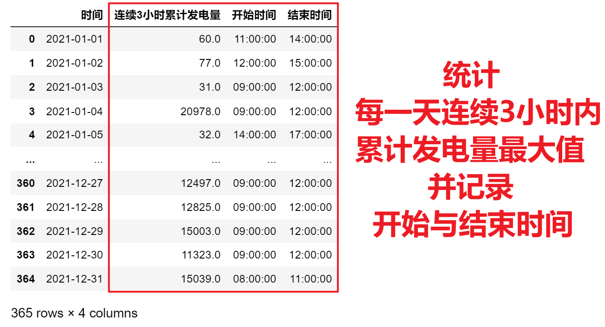

<p style="font-size: 90px;font-weight: bold;text-align: center;color: red;">带着问题学Pandas</p>
# <font color='red'>问题九十四：统计每天太阳能发电量最多的时间段？（项目实战）</font>



<font color = 'green'>连续</font>的三个小时为一个时间段，例如：  

2点至5点发电量总量；  

3点至6点发电量总量；  

4点至7点发电量总量

### 方式一

数据加载与时间转换

```Python
import pandas as pd
data = pd.read_csv('./太阳能发电/太阳能发电量分析.csv')
data['时间'] = pd.to_datetime(data['时间'])
data['日期'] = data['时间'].dt.date
data['时分秒'] = data['时间'].dt.time
data
```

连续3小时内总发电量求和

```Python
def func1(item):
    sub = item['太阳能发电量'] + item['太阳能发电量'].shift(1) + item['太阳能发电量'].shift(-1)
    sub = sub.to_frame('连续的三个小时发电量')
    return pd.concat([item,sub],axis = 1)
res = data.groupby('日期').apply(func1)
res
```

统计每一天连续3小时发电量最大值

```Python
def func2(item):
    idx = item['连续的三个小时发电量'].argmax()
    sub = pd.DataFrame({'时间':item['日期'].iloc[idx],
                         '连续3小时累计发电量':item['连续的三个小时发电量'].iloc[idx],
                         '开始时间':item['时分秒'].iloc[idx-1],
                         '结束时间':item['时分秒'].iloc[idx+1]},index = [item['日期'].iloc[idx]])
    return sub
result4 = res.groupby('日期').apply(func2).reset_index(drop = True)
result4.to_csv('./太阳能发电/solar_result4.csv',index = False)
result4
```

### 方式二

rolling滚动求和

```Python
import pandas as pd
data = pd.read_csv('./太阳能发电/太阳能发电量分析.csv')
data['时间'] = pd.to_datetime(data['时间'],utc=True)
data[['日期','时分秒']] = data['时间'].astype(str).str.split(' ',expand=True)
data['时分秒'] = data['时分秒'].str.split('+').map(lambda x : x[0])
def func(item):
    item['累计发电量'] = item.rolling(3,min_periods=1)['太阳能发电量'].sum()
    item['开始时间'] = item['时分秒'].shift(2)
    return item.sort_values('累计发电量').iloc[-1][['累计发电量','开始时间','时分秒']]
result = data.set_index('时间').groupby('日期').apply(func)
result.columns = ['连续3小时累计发电量','开始时间','结束时间']
result.index.name = '时间'
result
```

