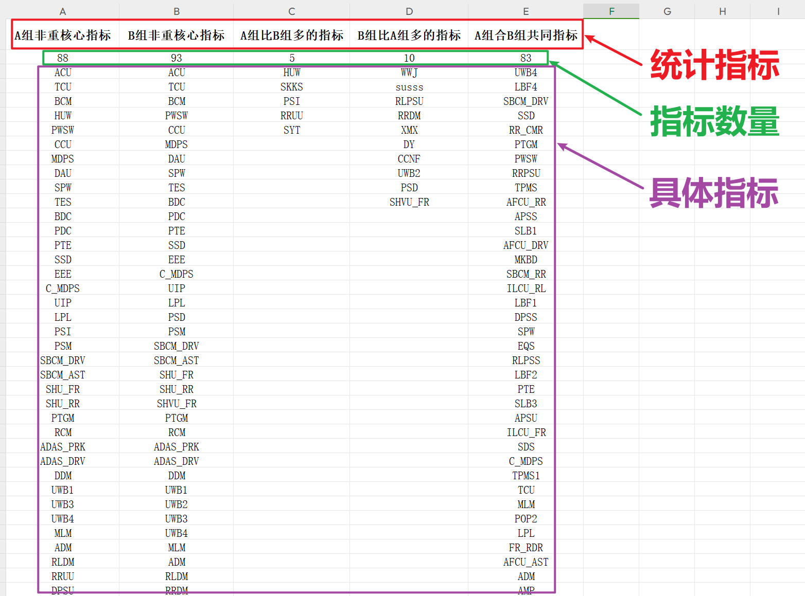

<p style="font-size: 90px;font-weight: bold;text-align: center;color: red;">带着问题学Pandas</p>
# <font color='red'>问题九十五：复杂数据比对？（项目实战）</font>



### 数据查看

```Python
import numpy as np
import pandas as pd
df_A = pd.read_csv('./A组.csv')
df_B = pd.read_csv('./B组.csv')
display(df_A.head(),df_B.head())
```

### 空数据处理

```Python
res1 = df_A.iloc[2:,3].dropna()
res2 = df_B.iloc[2:,3].dropna()
display(res1,res2)
```

### A、B非重核心指标去重

```Python
# 集合知识点
s1 = set(res1) # A 就是 s1
s2 = set(res2) # B 就是 s2
print(s1,len(s1))
print(s2,len(s2))
```

### A与B核心指标差异

```Python
# A中有B中没有
res3 = s1.difference(s2)
print(res3,len(res3))
# B中有的A没有
res4 = s2.difference(s1)
print(res4,len(res4))
```

### A与B共同核心指标

```Python
# A和B共同指标，交集
res5 = s1.intersection(s2)
print(res5,len(res5))
```

### 指标个数统计

```Python
length = res1.size
res1 = [length] + list(res1.values) # A中非重核心指标

length = res2.size
res2 = [length] + list(res2.values) # B中非重核心指标

length = len(res3)
res3 = [length] + list(res3) # A中有B中没有

length = len(res4)
res4 = [length] + list(res4) # B中有A中没有

length = len(res5)
res5 = [length] + list(res5) # A和B中都有的元素，交集

print(res3)
```

### 长度补齐

```Python
# 数据合并，将其变为DataFrame
# 数据长度，不一致，所以报错
result = pd.DataFrame({'A组非重核心指标':res1,'B组非重核心指标':res2,
                       'A组比B组多的指标':res3,'B组比A组多的指标':res4,
                       'A组合和B组共同指标':res5})
result
```

```Python
# 数据长度补齐
len_max = max([len(res1),len(res2),len(res3),len(res4),len(res5)])

# 将每一个列表，进行长度的补齐，使用空数据，进行补齐
def func(res):
    length = len(res) # 当前长度
    if len_max > length:
        res = res + [np.nan]* (len_max - length)
    return res
res1 = func(res1)
res2 = func(res2)
res3 = func(res3)
res4 = func(res4)
res5 = func(res5)

# 构建DataFrame，并保存
result = pd.DataFrame({'A组非重核心指标':res1,'B组非重核心指标':res2,
                       'A组比B组多的指标':res3,'B组比A组多的指标':res4,
                       'A组合和B组共同指标':res5})

display(result.head(10))
result.to_csv('./数据比对结果.csv',index = False)
```

