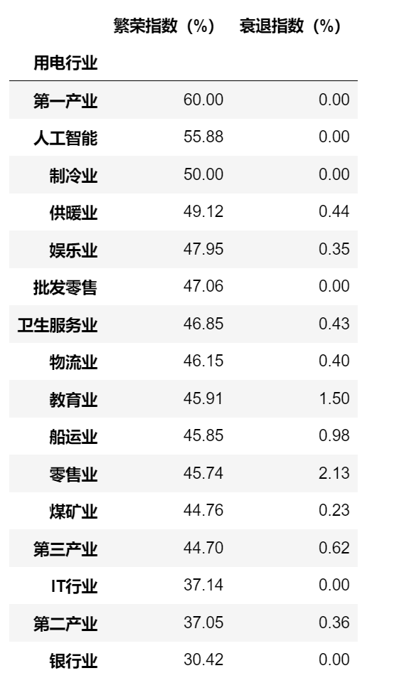

<p style="font-size: 90px;font-weight: bold;text-align: center;color: red;">带着问题学Pandas</p>
# <font color='red'>问题九十七：用电企业繁荣指数与衰退指数统计？（项目实战）</font>

**统计不同行业2021年9月份的繁荣指数和衰退指数**  

* 繁荣指数=月度用电量超过去年同期的企业数量/该行业总用户数量$*$100%   

* 衰退指数=月度用电量小于去年同期用电量20%的企业数量/行业用户数量$*$100%）  

**计算结果保留2位小数，并按照繁荣指数降序排序。**



### apply自定义函数高级应用

```Python
data = pd.read_csv('企业用电数据处理(答案).csv')
def func(item):
    return pd.Series([sum(item['202209'] > item['202109'])*100/item.shape[0],
                      sum(item['202209'] < item['202109']*0.2)*100/item.shape[0]],
                     index=['繁荣指数（%）', '衰退指数（%）'])
result = data.groupby('用电行业').apply(func).round(2) # 保留两位小数
result.sort_values(by = '繁荣指数（%）',ascending=False,inplace=True)
result.to_csv('./企业用电繁荣与衰退指数统计(答案).csv',index = False)
result
```

