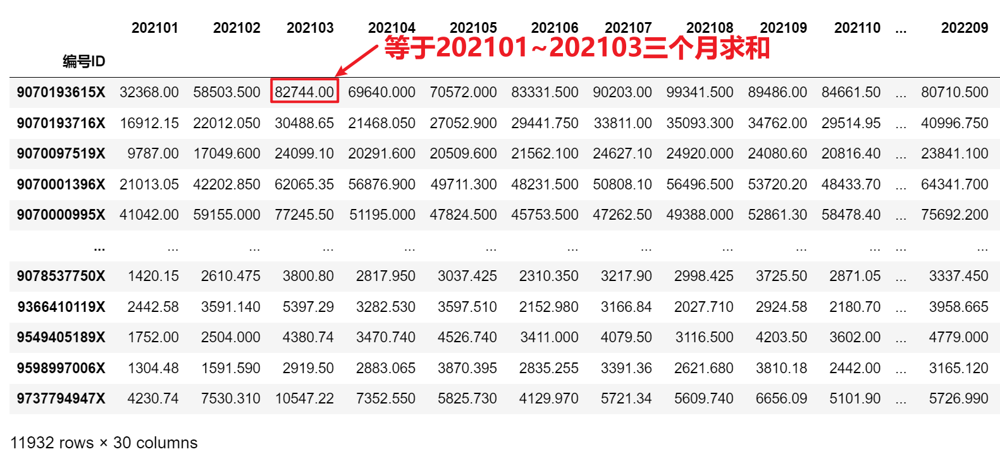

<p style="font-size: 90px;font-weight: bold;text-align: center;color: red;">带着问题学Pandas</p>
# <font color='red'>问题九十八：企业用电量连续三个月累计汇总？（项目实战）</font>

统计每个用户的 <font color='red'>t-2</font> 至 <font color = 'red'>t</font> 时段的总用电量 

* t表示当前时刻

* 如:2022年12月统计的窗口为2022年10月至2022年12月, 2023年6月统计的窗口为2023年4月至2023年6月 

* 空数据填充规则：
   * 起始月使用原数据填充;
   * 第二个月空数据使用前两个月用电量之和填充；



### 滚动求和累计求和

```Python
import pandas as pd
data = pd.read_csv('./企业用电数据处理(答案).csv')

data.set_index('编号ID',inplace=True)
# display(data)
# 第一步，连续三个月用电量滚动求和
result = data.iloc[:,1:].T.rolling(3).sum()
# display(result)

# 第二步，空数据填充
fillna = data.iloc[:,1:3].T.cumsum()
result.iloc[:2] = fillna
result = result.T # 数据转置
result.to_csv('./企业用电量连续三个月累计汇总.csv',index = False)
result
```

