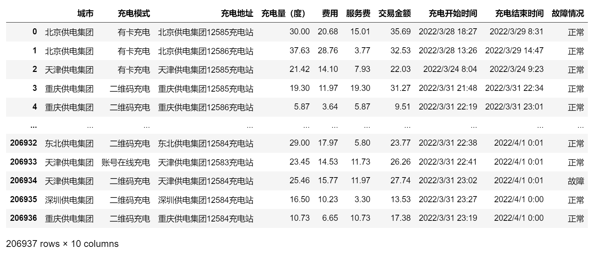
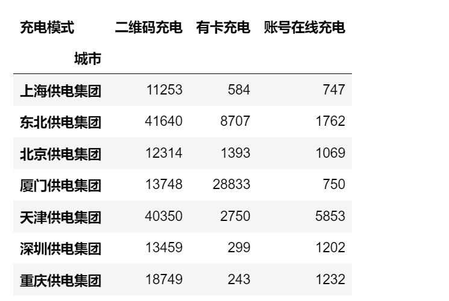
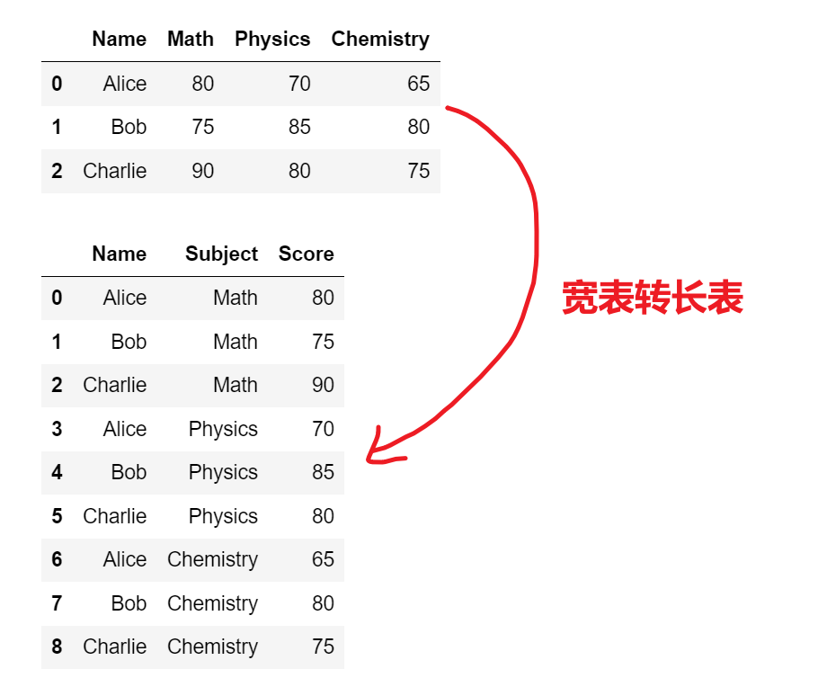

<p style="font-size: 90px;font-weight: bold;text-align: center;color: red;">带着问题学Pandas</p>
# <font color='red'>问题九十九：充电桩充电次数统计计数？（项目实战）</font>

**按照所属城市和充电模式统计<font color = 'red'>充电次数</font>**




统计结果如下：




### 分组统计计数与数据透视

```Python
import pandas as pd
import numpy as np
data = pd.read_csv(r'./充电桩数据分析.csv')
res = data.groupby(['城市','充电模式']).size() # 分组统计计数
# display(res) # 这个数据是Series
res = res.reset_index(name = '充电次数') # 重置行索引，行索引会变为列索引
# display(res) # 这里的res是DataFrame

# pivot透视表，将某一列的值作为新的字段
res = res.pivot(columns=['充电模式'],index = '城市',values=['充电次数'])
# display(res) # 此时会出现列多重索引

res = res.droplevel(level = 0,axis = 1) # 删除列多层索引，将充电数次删除
# display(res)

# 修改列索引名
res.columns.names = ['']
res.index.names = ['']
res.to_csv('./充电桩各城市不同充电方式次数统计.csv')
res
```

 `melt` 函数可以将DataFrame从宽格式（wide format）转换为长格式（long format），这在数据重塑和转换中非常有用。 

```Python
import pandas as pd
data = {
    'Name': ['Alice', 'Bob', 'Charlie'],
    'Math': [80, 75, 90],
    'Physics': [70, 85, 80],
    'Chemistry': [65, 80, 75]}
df = pd.DataFrame(data)
display(df)
res = pd.melt(df, id_vars=['Name'], var_name='Subject', value_name='Score')
res
```



